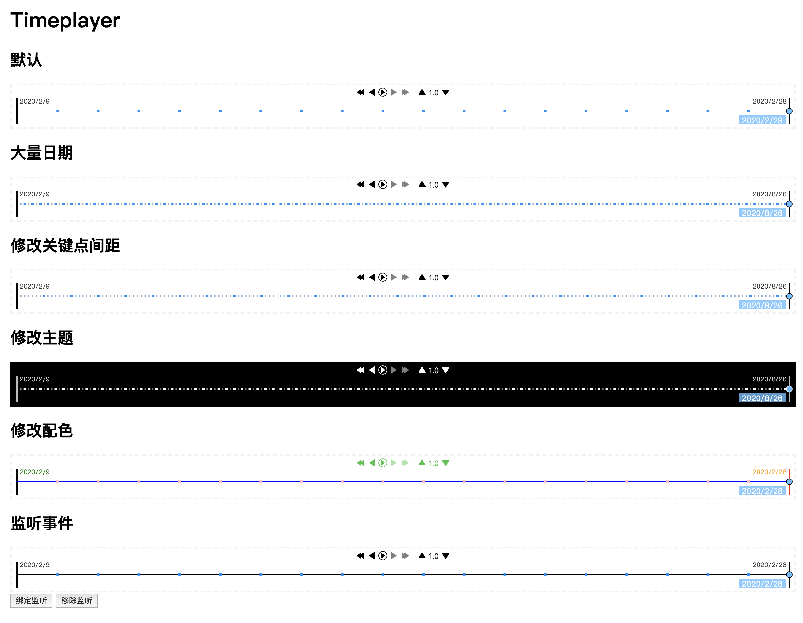

# Timeplayer
A time player/travel module

[中文文档](https://zmofei.github.io/timeplayer/dist/)

# Example

## 如何调试项目

在Clone项目之后，需要通过`npm install`命令去安装项目所需的依赖，本项目使用Typescript+Webpack构建。

安装完成所需依赖之后可以运行`npm run start`开始调试和开发，该命令会打开一个浏览器自动运行项目的demo(`public/index.html`)，主要的代码位于`src/`目录下，入口文件为`src/timepalyer.ts`，修改文件后预览页面会自动刷新。

## 打包项目

在调试完成之后可以直接运行`npm run build`进行打包，该命令会将项目打包到`dist`目录中，其中`dist/timeplayer.js`就是打包后的项目文件。